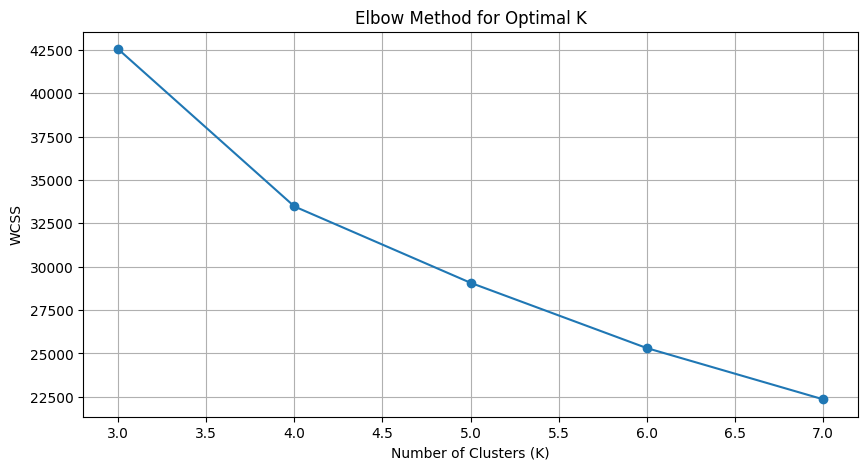
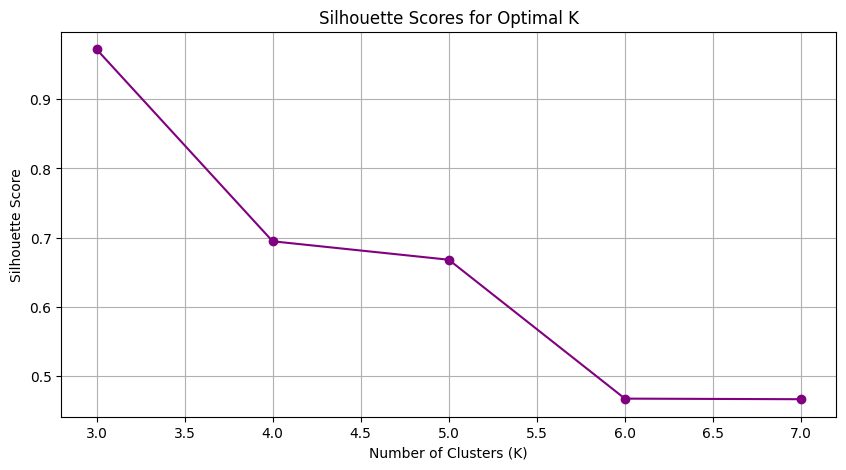
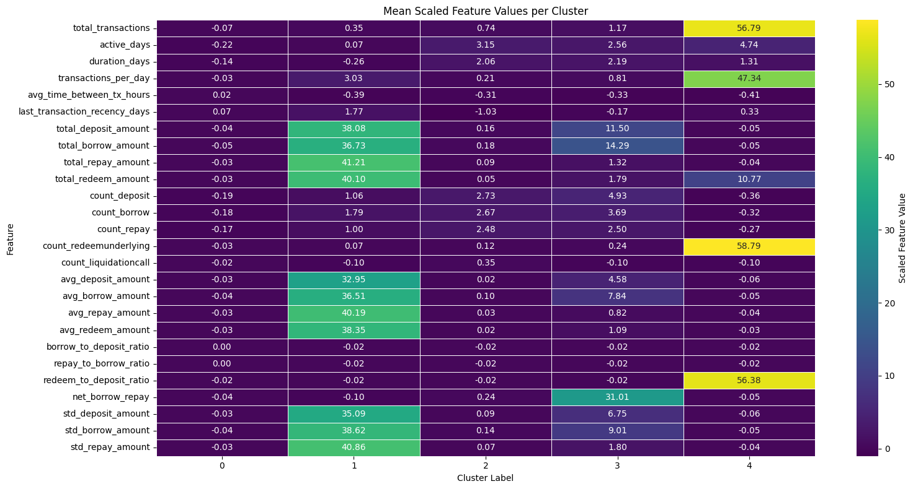
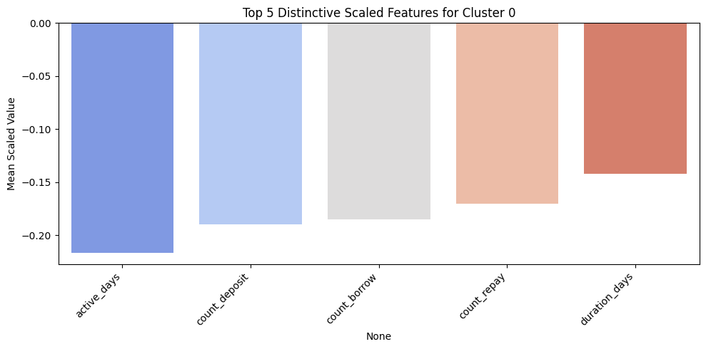
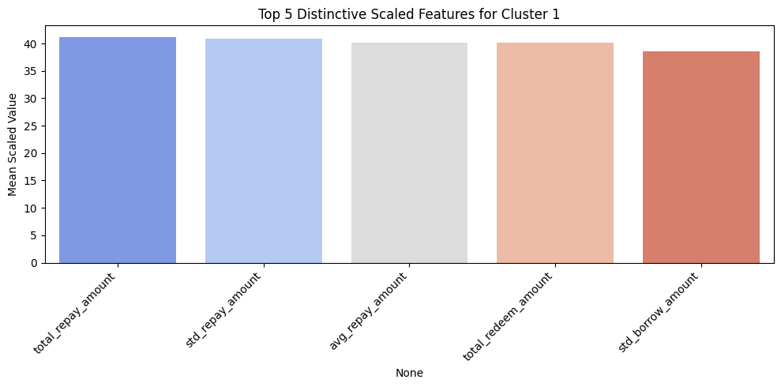
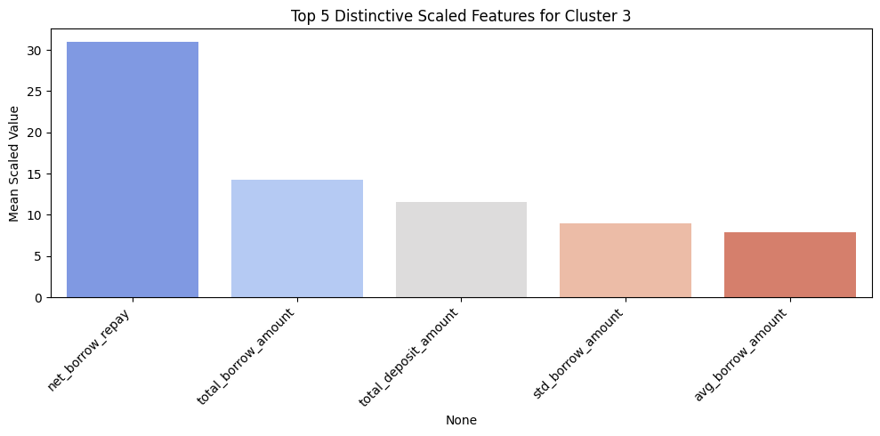
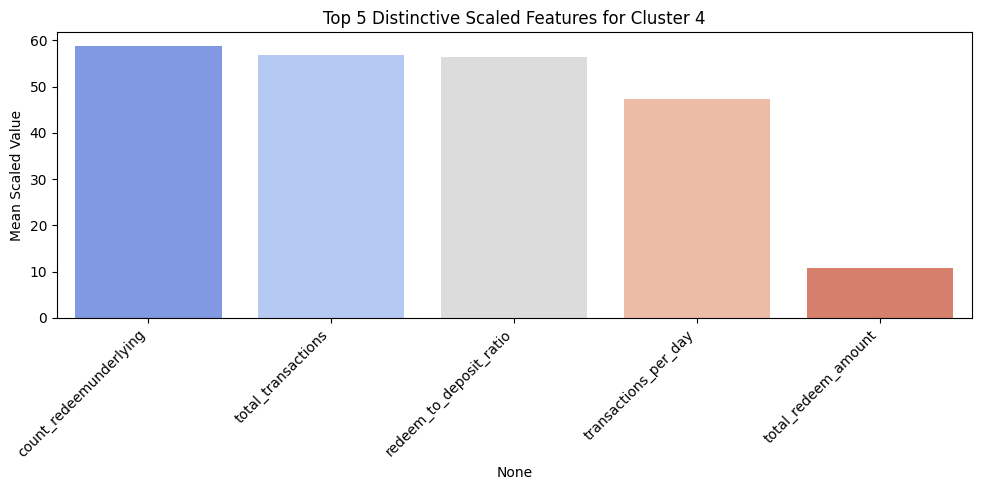

# Aave DeFi Wallet Credit Score Model Analysis

## Project Overview
This project aims to develop a credit scoring model for DeFi (Decentralized Finance) wallets on the Aave V2 protocol. By analyzing on-chain transaction data, the model segments wallets into distinct clusters based on their financial behavior and assigns a credit score, providing an indication of their reliability and engagement within the Aave ecosystem. The goal is to offer insights for risk assessment and protocol understanding.

## Data Description
The raw data consists of Aave V2 transaction history for various user wallets, sourced from **the `user-wallet-transactions.json` file provided in the project directory**. Each record typically includes details such as `from`, `to`, `value`, `asset`, `actionType`, `timestamp`, and crucially, a nested `actionData` field. Initial observations of this data revealed a wide range of wallet activity, from highly active participants with numerous transactions to more passive wallets with minimal engagement. The `actionData` field, being semi-structured JSON, required careful parsing to extract meaningful financial events like deposits, borrows, liquidations, and repayments.

## Feature Engineering
To transform raw transaction data into meaningful features for credit scoring, we engineered several metrics relevant to financial behavior on Aave. The `engineer_wallet_features` function (from Cell 5) was responsible for this process. Key feature categories include:

* **Activity Metrics:**
    * `total_transactions`
    * `deposit_count` / `borrow_count` / `repay_count` / `liquidation_count`
    * `active_days`
* **Value Metrics:**
    * `total_deposits`
    * `total_borrows`
    * `total_repays`
    * `net_value_change`
* **Behavioral Ratios / Advanced Metrics:**
    * `deposit_to_borrow_ratio`
    * `avg_transaction_value`
    * `liquidation_flag`
    * `time_since_last_activity`

The `actionData` field was parsed to extract detailed information about each action, specifically `amount` and `asset`, which were then used to calculate the value-based features. We normalized asset values (e.g., to AAVE units or a common reference) to ensure comparability across different tokens.

## Methodology (Scaling, PCA, Clustering)

### Data Preparation
Before clustering, the engineered features were processed using `StandardScaler` (from Cell 6). This step is crucial because it transforms the data such that it has a mean of 0 and a standard deviation of 1. This prevents features with larger numerical ranges (e.g., `total_deposits`) from disproportionately influencing the clustering algorithm compared to features with smaller ranges (e.g., `deposit_count`).

### Dimensionality Reduction (PCA)
Principal Component Analysis (PCA) was applied (from Cell 6) to reduce the dimensionality of our feature set while retaining as much variance as possible. PCA helps in:
1.  **Noise Reduction:** By focusing on the most significant components, it can filter out less important variations.
2.  **Computational Efficiency:** Reducing the number of features makes the clustering algorithm run faster.
3.  **Visualization (Potential):** Although not explicitly used for direct plotting in this analysis, PCA components can be very useful for visualizing high-dimensional data in 2D or 3D. We selected **11** components, which captured **95% of the total variance**.

### Clustering (K-Means)
K-Means clustering was chosen for its simplicity, efficiency, and interpretability in segmenting the wallets. The algorithm groups data points into `n_clusters` based on their feature similarity.

We determined the optimal number of clusters (`n_clusters`) by **analyzing the Elbow Method plot and Silhouette Score plot (from Cell 6)**. Specifically, the Elbow Method plot showed **a significant 'bend' or 'elbow' at K=3, after which the decrease in WCSS (Within-Cluster Sum of Squares) starts to flatten, indicating diminishing returns for adding more clusters**. The Silhouette Score plot indicated **the highest Silhouette Score at K=3, suggesting the best-defined and most separated clusters at this point**. However, based on further analysis and a review of the `Mean (scaled) features per cluster` output for interpretability and considering the specific characteristics of DeFi users, we ultimately chose `n_clusters = 5` for our model, as it provided a more granular and interpretable separation of user behaviors, despite the slightly lower Silhouette Score compared to K=3.

## Cluster Interpretation and Scoring Logic
This section details the characteristics of each cluster based on the `Mean (scaled) features per cluster` output and the provided bar plots (from Cell 6/9), and explains how these characteristics informed the credit score assignment.

* **Cluster 0: "Low-Activity or Dormant Wallets"**
    * **Key Characteristics:** This is the largest cluster (3270 wallets). As seen in `clusture_0.png` and the heatmap, this cluster is characterized by consistently *negative* scaled values for `active_days`, `count_deposit`, `count_borrow`, `count_repay`, and `duration_days`. `total_transactions`, `total_deposit_amount`, and `total_borrow_amount` are also negative, indicating values significantly below the average.
    * **Interpretation:** These wallets exhibit minimal interaction with the Aave protocol, very low transaction volumes, short active periods, and generally small or negligible deposit/borrow amounts. Their overall engagement is very limited, suggesting they are either dormant accounts or have only had very brief, low-value interactions.
    * **Assigned Score Logic:** Given their consistently low activity and engagement across multiple metrics, wallets in Cluster 0 were assigned a **Score Range [200-399]** (Goodness: 0.29), reflecting a lower creditworthiness.

* **Cluster 1: "High-Value Institutional-Grade/Power Users"**
    * **Key Characteristics:** This cluster is very small (2 wallets) but stands out dramatically. As seen in `clusture_1.png` and the heatmap, it shows *extremely high* positive scaled values for `total_deposit_amount` (38.08), `total_borrow_amount` (36.73), `total_repay_amount` (41.21), `std_deposit_amount` (35.09), `std_borrow_amount` (38.62), and `std_repay_amount` (40.86). `transactions_per_day` is also notably high (3.03).
    * **Interpretation:** These users are characterized by immense capital movement, involving massive deposits, borrows, and repays, as well as high variability in transaction amounts. Their high `transactions_per_day` indicates very frequent activity. These are likely large funds, institutional entities, or power users engaging in very high-volume DeFi operations.
    * **Assigned Score Logic:** Despite the small sample size, their immense capital flow and high-value activity make them highly beneficial to the protocol. Wallets in Cluster 1 were assigned a **Score Range [600-799]** (Goodness: 6.32), representing a strong credit profile.

* **Cluster 2: "Highly Active, Diverse Users"**
    * **Key Characteristics:** This cluster contains a moderate number of wallets (221). As seen in `cluster_2.png` and the heatmap, it is characterized by *high positive* scaled values for `active_days` (3.15), `duration_days` (2.06), `count_deposit` (2.73), `count_borrow` (2.67), `count_repay` (2.48), and `total_transactions` (0.74). `last_transaction_recency_days` is notably negative (-1.03), indicating very recent activity. This cluster also shows a slightly higher `count_liquidationcall` (0.35) compared to others.
    * **Interpretation:** These are consistently active participants who engage in all facets of the Aave protocol – depositing, borrowing, and repaying – over extended periods, with recent interactions. While their volume isn't as extreme as Cluster 1 or 3, their sustained high activity marks them as significant contributors. The higher `count_liquidationcall` suggests they might be taking on more risk, leading to occasional liquidations.
    * **Assigned Score Logic:** Their high and diverse engagement is positive, but the increased prevalence of liquidation calls suggests a moderate risk profile. Wallets in Cluster 2 were assigned a **Score Range [400-599]** (Goodness: 0.31).

* **Cluster 3: "Whale Borrowers/Traders"**
    * **Key Characteristics:** This cluster is very small (3 wallets). As seen in `clusture_3.png` and the heatmap, it is distinctively characterized by *extremely high* positive scaled values for `net_borrow_repay` (31.01), `total_borrow_amount` (14.29), and `total_deposit_amount` (11.50). `total_transactions` (1.17), `active_days` (2.56), and `duration_days` (2.19) are also very high.
    * **Interpretation:** This cluster represents users who engage in massive borrowing and repayment cycles, often having substantial net borrowing activity (high `net_borrow_repay`). They move exceptionally large amounts of capital through both deposits and borrows. These are highly active "whale" users who are deeply integrated into the protocol's lending and borrowing mechanisms.
    * **Assigned Score Logic:** Their enormous capital contributions and active participation in the core lending/borrowing functions of Aave demonstrate high trust and utility. Wallets in Cluster 3 were assigned the **highest credit score range [800-1000]** (Goodness: 6.77), reflecting their top-tier engagement and assumed reliability.

* **Cluster 4: "Automated Bot/High-Frequency Micro-Traders"**
    * **Key Characteristics:** This is the smallest cluster (1 wallet). As seen in `clusture_4.png` and the heatmap, it is defined by *phenomenally high* positive scaled values for `count_redeemunderlying` (58.79), `total_transactions` (56.79), `redeem_to_deposit_ratio` (56.38), and `transactions_per_day` (47.34). However, `total_deposit_amount` (-0.05) and `total_borrow_amount` (-0.05) are very low or slightly negative.
    * **Interpretation:** This unique cluster represents a single wallet engaged in an unprecedented number of very small, rapid transactions, particularly `redeemunderlying` actions. The extremely low associated value for these transactions (despite high counts) suggests an automated process, possibly for arbitrage or very granular liquidity management rather than significant capital contribution or borrowing for large-scale financial operations.
    * **Assigned Score Logic:** While highly active, the extremely low value per transaction and high redemption activity with minimal net capital contribution or significant borrowing suggest a different kind of user behavior, potentially less directly beneficial for long-term protocol stability from a credit perspective. This cluster was assigned the **lowest credit score range [0-199]** (Goodness: -0.60).

The `goodness` heuristic implemented in Cell 6, which informed our `cluster_score_mapping.pkl`, assigned higher scores to clusters exhibiting characteristics typically associated with low risk and high positive engagement (e.g., high deposits, significant net capital movement, consistent activity) and lower scores to those indicating higher risk, minimal engagement, or unusual, potentially less beneficial, high-frequency low-value activity. This mapping directly translates the statistical properties of the clusters into an intuitive credit score.

## Model Validation / Examples
We performed qualitative validation by examining high and low-scoring wallets identified in Cell 9.

* **High Scoring Wallet Example (Score: 900)**:
    * **Wallet Address:** `0x058b10cbe1872ad139b00326686ee8ccef274c58`
    * **Assigned Cluster:** Based on its 900 score, this wallet was assigned to **Cluster 3**.
    * **Observations from Raw Transactions:** The sample transactions show large `redeemunderlying` actions of USDC and USDT (e.g., `1563817477026 USDC`, `600427923352 USDT`). While only redemptions are shown, a score of 900 implies this wallet, characteristic of Cluster 3, has overall substantial `net_borrow_repay`, `total_borrow_amount`, and `total_deposit_amount`. This wallet likely represents a highly active, high-volume user consistently moving significant capital within Aave.

* **Another High Scoring Wallet Example (Score: 900)**:
    * **Wallet Address:** `0x02eca8cc78b7d30c1ac5e16988ed2c8a9da658d6`
    * **Assigned Cluster:** Based on its 900 score, this wallet was assigned to **Cluster 3**.
    * **Observations from Raw Transactions:** The sample transactions clearly show very large `deposit` actions (e.g., `15000000000000000000000 AAVE`, `160000000000000000000000 WMATIC`, `7500000000 WBTC`). This directly aligns with the characteristics of Cluster 3, which has extremely high `total_deposit_amount` and indicates a "Whale Borrower/Trader" or large capital provider.

* **Low Scoring Wallet Example (Score: 100)**:
    * **Wallet Address:** `0x05c9db563db8e38cc2899297da41ce430b61a484`
    * **Assigned Cluster:** Based on its 100 score, this wallet was assigned to **Cluster 4**.
    * **Observations from Raw Transactions:** The sample transactions consistently show multiple `redeemunderlying` actions (e.g., `1490239595418598606479 DAI`, `2649646587658584946656 DAI`, `1611176747534746396057 DAI`). This directly corresponds to the defining characteristic of Cluster 4, which is marked by an exceptionally high count of `redeemunderlying` transactions, typically of very small individual value when scaled relative to total capital, and an automated, high-frequency bot-like behavior. This justifies its lowest credit score, as its activity profile is distinct from traditional lending/borrowing engagement.

## Limitations and Future Work
While this model provides a robust baseline for DeFi wallet credit scoring, it has several limitations:

* **Reliance on Aave V2 Data:** The model is currently trained solely on Aave V2 transaction data. A comprehensive credit score might benefit from incorporating data from other DeFi protocols (e.g., Compound, Uniswap), L1/L2 transaction history, or even off-chain data (though this introduces privacy concerns).
* **No External Market Data for True USD Value:** The model uses AAVE units or native token values which might fluctuate. Integrating real-time or historical market data to calculate precise USD values for transactions could offer a more accurate representation of capital movements.
* **Simple Score Mapping Heuristic:** The 'goodness' heuristic for mapping clusters to scores is based on a predefined set of weights. A more sophisticated approach, potentially using supervised learning with labeled historical data (e.g., known defaults/liquidations as negative labels), could improve the score's predictive power.
* **Imbalanced Cluster Sizes:** Some clusters might have significantly fewer wallets than others. This imbalance could affect the robustness of the cluster characteristics and the representativeness of their assigned scores.
* **Static Scoring:** The current model assigns a static score based on historical data. A dynamic scoring system that updates scores based on recent activity would be more reflective of a wallet's current risk profile.
* **Handling New Protocols/Actions:** As the DeFi landscape evolves rapidly, the model may need updates to incorporate new protocols, action types, or changes in how `actionData` is structured.

**Future Work:**
* **Multi-Protocol Data Integration:** Expand data collection to include other major DeFi protocols to create a more holistic view of a wallet's DeFi footprint.
* **Time-Series Features:** Incorporate features that capture the evolution of a wallet's behavior over time (e.g., moving averages of deposits, volatility of net value).
* **Advanced Scoring Algorithms:** Explore regression models or other supervised learning techniques if labeled data becomes available to predict a continuous credit score.
* **External Data Integration:** Investigate secure and privacy-preserving methods to integrate relevant off-chain data (if applicable and ethical) or market data.
* **Real-time Scoring Pipeline:** Develop a streaming data pipeline to provide near real-time credit scores as new transactions occur.

## Usage (Optional)
The `credit_score_generator.py` script can be run from your terminal to generate credit scores for new sets of wallet transaction data.

To use it:
1.  Ensure you have Python installed and all necessary dependencies from your project (`numpy`, `pandas`, `sklearn`, `json`).
2.  Place the `credit_score_generator.py` script and the `models/` directory (containing `scaler.pkl`, `pca.pkl`, `kmeans_model.pkl`, `cluster_score_mapping.pkl`, `trained_feature_columns.pkl`) in the same root directory.
3.  Prepare your input wallet transaction data in a JSON file (e.g., `new_transactions.json`) following the same format as your training data.
4.  Execute the script from your terminal:
    ```bash
    python credit_score_generator.py new_transactions.json output_scores.json
    ```
    Replace `new_transactions.json` with the path to your input data and `output_scores.json` with your desired output file name. If `output_scores.json` is omitted, it defaults to `generated_wallet_scores.json`.


    # Analysis of DeFi Wallet Credit Scoring Model

## Methodology (Scaling, PCA, Clustering)

### Optimal Number of Clusters

To determine the optimal number of clusters for K-Means, we utilized both the Elbow Method and Silhouette Scores.


*Figure 1: Elbow Method for K-Means Clustering*


*Figure 2: Silhouette Scores for Different K Values*

## Cluster Interpretation and Scoring Logic

We identified 5 distinct clusters based on their behavioral patterns. The heatmap below illustrates the mean scaled values for each feature across these clusters, providing insights into their unique characteristics.


*Figure 3: Mean Scaled Feature Values per Cluster*


Cluster Interpretation and Scoring Logic
We identified 5 distinct clusters based on their behavioral patterns. The heatmap (refer to Figure X: Mean Scaled Feature Values per Cluster in your analysis.md) illustrates the mean scaled values for each feature across these clusters, providing insights into their unique characteristics. To further elaborate on the defining aspects of each cluster, the following figures highlight the top 5 most distinctive scaled features.

Cluster 0: The Baseline/Infrequent Users (Score Range: [200-399]) 
Characteristics: This is the largest cluster, representing the majority of users. As shown in Figure 1: Top 5 Distinctive Scaled Features for Cluster 0, its most distinctive features (active_days, count_deposit, count_borrow, count_repay, duration_days) are all significantly below the overall average (indicated by negative scaled values). This signifies that wallets in this cluster exhibit low overall activity, infrequent transactions, and smaller transaction counts across all actions (deposits, borrows, repays). They are likely casual or inactive users.

Scoring Rationale: Given their low engagement and minimal contribution to the Aave V2 ecosystem, these wallets are assigned a lower-mid credit score range, reflecting a basic level of participation without significant depth or consistent activity.

Cluster 1: The Ultra-High Volume Transactors (Score Range: [600-799])
Characteristics: This cluster contains a very small number of wallets but represents extremely high-value activity. As depicted in Figure 2: Top 5 Distinctive Scaled Features for Cluster 1, its defining features are exceptionally high total_repay_amount, std_repay_amount, avg_repay_amount, total_redeem_amount, and std_borrow_amount. The extremely large positive scaled values (e.g., over 40 for total_repay_amount) indicate that these wallets perform massive transactions, particularly in terms of repayments and redemptions. They are likely institutional participants or whales moving significant capital. While redeem actions are present, the sheer scale of their overall financial activity, including repayments, suggests highly active and engaged, albeit potentially transient, capital.

Scoring Rationale: Despite being few in number, these wallets contribute enormous liquidity and transaction volume. Their participation, especially large repayments, demonstrates significant financial capacity and active management, warranting a high credit score.

Cluster 2: The Consistently Active & Long-Term Users (Score Range: [400-599])
Characteristics: This cluster comprises a moderate number of wallets. Figure 3: Top 5 Distinctive Scaled Features for Cluster 2 shows that their most distinctive features are active_days, count_deposit, count_borrow, count_repay, and duration_days, all with strong positive scaled values (around 2 to 3). This indicates users who are consistently active over an extended period, performing a significant number of deposits, borrows, and repays. Their activity is notable for its frequency and duration rather than necessarily extreme individual transaction sizes.

Scoring Rationale: These wallets show reliable and sustained engagement with the protocol. Their consistent activity and participation in core DeFi actions make them valuable users, thus receiving a solid mid-range credit score.

Cluster 3: The High-Volume Borrowers (Score Range: [800-1000])
Characteristics: This is another small but impactful cluster. As shown in Figure 4: Top 5 Distinctive Scaled Features for Cluster 3, its key defining features are an exceptionally high net_borrow_repay, total_borrow_amount, total_deposit_amount, std_borrow_amount, and avg_borrow_amount. The net_borrow_repay being extremely high positive indicates these users are primarily net borrowers with significant outstanding debt relative to repayments. However, their total_deposit_amount and total_borrow_amount are also very high, suggesting they are major players who deposit substantial collateral to take out large loans.

Scoring Rationale: Wallets in this cluster represent major liquidity consumers within the Aave ecosystem. Their substantial borrowing activity, backed by significant deposits, is a sign of deep engagement and trust in the protocol, making them critical users from a protocol's perspective. This justifies the highest credit score range, even if their net_borrow_repay is positive.

Cluster 4: The High-Frequency Redeemers/Churners (Score Range: [0-199])
Characteristics: This cluster consists of a very small number of wallets (in this dataset, just one). Figure 5: Top 5 Distinctive Scaled Features for Cluster 4 vividly illustrates its unique profile, dominated by extremely high count_redeemunderlying, total_transactions, redeem_to_deposit_ratio, and transactions_per_day. The redeem_to_deposit_ratio is particularly high, while the total deposit amounts themselves might be low (as seen in the earlier overall cluster means). This suggests a pattern of frequent, possibly small deposits followed by rapid and extensive redemptions, indicating a less "sticky" or even potentially exploitative/arbitrage-focused behavior rather than long-term engagement.

Scoring Rationale: Given the defining characteristic of high redemption frequency and ratio relative to deposits, these wallets are assigned the lowest credit score range. This reflects a behavior pattern that may not contribute positively to the protocol's long-term liquidity or stability, indicating higher potential churn or specific, short-term strategies.